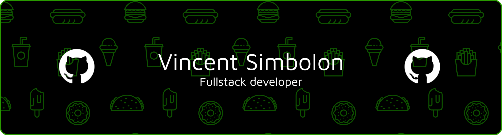

 

---

## 🐍 Pure-Blood Ambition

<table>
<tr>
<td width="50%">

**🪄 Hogwarts Career**

- 🏰 **House:** Slytherin - 🌑 **Specialization:** Advanced **Dark Arts** & Potions
- 🏆 **House Cup Winner** (2025)
- 🧪 Expert in weaving curses into complex algorithms
- Seeking the Elder Wand (or at least a bug-free compiler)

</td>
<td width="50%">

**💻 The Digital Dungeon**

- Transmuting **C++** and **Python** into digital sorcery
- Analyzing ancient scripts (Legacy Code)
- 🐕 Loyal friend to magical creatures (and dogs!)
- 🎮 Duelist in the gaming realm when not brewing code

</td>
</tr>
</table>

---

## 🧪 Tech Sorcery & Tools

### Forbidden Languages

### Magical Platforms 🎮

---

## 📊 Grimoire Stats

 

---

## 📈 Dark Magic Activity

---

### 🐍 Watch the Basilisk Eat My Contributions!

<picture>
  <source media="(prefers-color-scheme: dark)" srcset="https://raw.githubusercontent.com/vincentjcas/vincentjcas/output/pacman-contribution-graph-dark.svg">
  <source media="(prefers-color-scheme: light)" srcset="https://raw.githubusercontent.com/vincentjcas/vincentjcas/output/pacman-contribution-graph.svg">
  
</picture>

---

## ☕ Support the Dark Arts

---

**"Ssa-hasi-eth: Ssllytherin, ssa-hasi-eth ssee-tha-sss."** 🐍 

